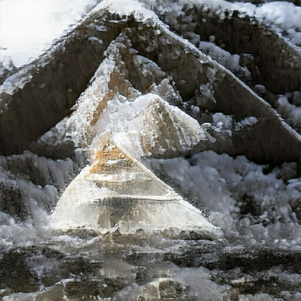

# big-sleep-mps

A Mac port of [Big Sleep](https://github.com/lucidrains/big-sleep) — Ryan Murdock's
CLIP + BigGAN text-to-image technique, packaged by Phil Wang (lucidrains) — that runs
on Apple Silicon through PyTorch's MPS backend. It is 2021-era "dream" imagery, not a
diffusion model; think of it as a retro text-to-image toy that now runs at about one
step per second on a MacBook instead of one step every two minutes.

</img> </img>

*Left: "a pyramid made of ice" from this fork, `dream "a pyramid made of ice" --fast` on an M1 Max — 200 steps, about three minutes wall including model load. Right: upstream's sample for the same prompt (V100, 20 × 1050 steps). The other images in `samples/` are upstream's.*

## Install

This fork is **not on PyPI**. `pip install big-sleep` installs lucidrains' original
package, which asserts CUDA at import and cannot run on a Mac. Install from git:

```bash
pip install git+https://github.com/intrinsic-labs/big-sleep-mps
```

Requires Python 3.9+ and PyTorch 2.0+ (installed for you). Weights download on first
run to `~/.cache/clip` and `~/.pytorch_pretrained_biggan` (~800 MB for the 512 px model).
CUDA and CPU still work; the device is picked automatically (MPS → CUDA → CPU).

## Usage

```bash
dream "a pyramid made of ice"                    # 512 px, 1 × 500 steps, 96 cutouts
dream "a pyramid made of ice" --fast             # 1 × 200 steps, 64 cutouts
dream "a pyramid made of ice" --upstream_defaults  # lucidrains' 20 × 1050 schedule
dream "a pyramid made of ice" --output_dir out --seed 42
```

Images are saved to the current directory (or `--output_dir`). The best-scoring image
so far is written alongside as `<name>.best.png` (`--save_best=False` to disable).
Multiple prompts are separated by `|`; `--text_min "blur|zoom"` penalises phrases.
`--seed N` reproduces a run; `--random` picks a fresh seed. `python -m big_sleep.cli --help`
lists everything.

The Python API is unchanged from upstream:

```python
from big_sleep import Imagine
Imagine(text="fire in the sky", lr=5e-2, save_every=25, save_progress=True)()
```

## Why it was slow, and the fix

The original port ran, but one optimisation step at the CLI defaults took ~128 s on an
M1 Max — the documented default run would have taken a month. The whole cost was one
MPS kernel: `mps_convolution_backward` on CLIP's 32×32/stride-32 patch-embedding conv is
~200× slower when the incoming gradient is a permuted view with a storage offset, which
is exactly what autograd hands it because CLIP prepends the class token with `torch.cat`.
A one-line `.contiguous()` hook on that conv's output fixes it; freezing the CLIP and
BigGAN weights (they were never in the optimiser) takes another third off.

| step (M1 Max 32 GB, torch 2.14.0) | before | after |
|---|---|---|
| 512 px, 96 cutouts (defaults) | 128,201 ms | 1,020 ms |
| 512 px, 64 cutouts (`--fast`) | 86,232 ms | 736 ms |
| 128 px, 8 cutouts | 10,784 ms | 154 ms |

Details and the isolated kernel timings are in
[`docs/pytorch-issue-draft.md`](docs/pytorch-issue-draft.md); the standalone repro is
[`scripts/mps_conv_backward_repro.py`](scripts/mps_conv_backward_repro.py), and
`scripts/bench_step.py` times a step on your own machine.

## What this fork changes

- Device selection (MPS / CUDA / CPU) in one place, `big_sleep/device.py`.
- The MPS speed fix and frozen CLIP/BigGAN weights (no-ops for CUDA/CPU numerics).
- Mac-sized CLI defaults (`--upstream_defaults` restores the originals), `--fast`,
  `--output_dir`, `--debug`, and a working `--seed` (Python's `random`, which picks the
  cutout offsets, is now seeded too) and `--torch_deterministic`.
- A CPU smoke test in CI. No PyPI publishing.

## Credits and license

All of the interesting ideas are Ryan Murdock's ([@advadnoun](https://twitter.com/advadnoun));
the package this fork is built on is [lucidrains/big-sleep](https://github.com/lucidrains/big-sleep),
whose git history is preserved here. CLIP is OpenAI's; BigGAN-deep weights are via
[pytorch-pretrained-BigGAN](https://github.com/huggingface/pytorch-pretrained-BigGAN).
MIT License — upstream copyright retained, see [LICENSE](LICENSE).

```bibtex
@misc{unpublished2021clip,
    title  = {CLIP: Connecting Text and Images},
    author = {Alec Radford, Ilya Sutskever, Jong Wook Kim, Gretchen Krueger, Sandhini Agarwal},
    year   = {2021}
}
@misc{brock2019large,
    title   = {Large Scale GAN Training for High Fidelity Natural Image Synthesis},
    author  = {Andrew Brock and Jeff Donahue and Karen Simonyan},
    year    = {2019},
    eprint  = {1809.11096},
    archivePrefix = {arXiv},
    primaryClass = {cs.LG}
}
```
