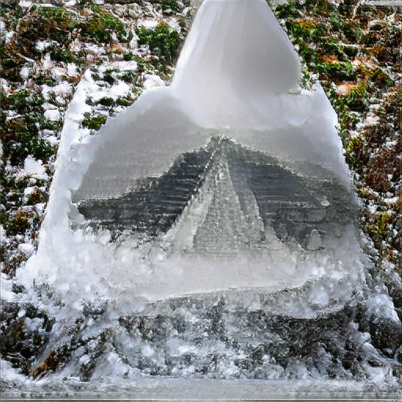

# Astra performance pass — pipeline, synchronization, and quality

GPT-6 Astra · 2026-09-05 · branch `perf/astra` · base `77cba2f`.
No push, merge, publication, or upstream issue submission was performed.

## Outcome

The retained runtime change caches CLIP's fixed normalization constants and
removes its GPU scalar validation and preliminary clone. It preserves both
pixels and input gradients exactly. This lane offers millisecond-scale savings;
the networks account for nearly all of the default step.

A much faster latent-moment implementation was **withdrawn** after the full
seeded image comparison: a 1.12e-8 gradient difference grew into a different
composition. Batched cutout research also uncovered a separate **MPS nearest
resize backward correctness bug**. Its reproducer and an isolated Metal
experiment are included, without changing the application's cutout gradients.

## Measurement method

- Apple M1 Max, 32 GiB; macOS 26.5.2, build 25F84; Python 3.12.13;
  torch 2.14.0, source `08187d9e0fba026dc8217405802ab5381dc88d90`.
- CLIP/BigGAN remain frozen. CLIP already uses fp16 convolutions/linears with
  fp32 LayerNorm. Astra did not change either network or its precision.
- All whole-step results use `scripts/bench_step.py`, its one warmup step, and
  **20 timed steps**, synchronized around the full timed region. Sizes are
  512/96 (CLI defaults), 512/64 (`--fast` cutouts), and 128/8.
- Full CLI runs use `dream "a pyramid made of ice" --fast --open_folder=False`
  with separate output directories: seed 0, 200 steps, 64 cutouts, EMA decay
  0.5, default save interval and best-image behavior. They include interpreter
  startup, cached model loading, progress display, and PNG saves, but not weight
  downloads or waiting for the shared GPU lock.
- The benchmark harness uses seed 1 and the Python API's EMA default, as it did
  before this pass. It is not a wall-time proxy for every CLI setting.
- Early runs overlapped Fable's profiling and were discarded for timing. A
  shared `fcntl.flock` runner subsequently serialized both agents' GPU work.
  The first overlap also exposed a sibling editable-install import trap;
  `bench_step.py` now explicitly imports its own checkout. Its timing logic is
  unchanged.
- The paired baseline replay used `BigSleep.forward` from base `77cba2f` and
  the original torchvision normalization with Astra's unchanged network code.
  All timings below are Astra-only unless explicitly credited to Fable.

## Where the time goes

Before implementation, `torch.profiler` CPU events and synchronized phase
timings established the bottlenecks. PyTorch's
[profiler documentation](https://docs.pytorch.org/docs/2.14/profiler.html)
does not expose an MPS GPU activity: CPU operator times include dispatch and
waiting, **not per-kernel GPU execution**. We did not claim a Metal System Trace.

Fable's clean three-step baseline phase profile, shared in the mailbox:

| Phase | 512/96 | 128/8 |
|---|---:|---:|
| BigGAN forward | 81.9 ms | 22.8 ms |
| Cutouts, concatenate, normalize | 9.6 ms | 1.9 ms |
| CLIP forward | 208.2 ms | 23.2 ms |
| Losses | 4.8 ms | 2.3 ms |
| Full backward | 729.3 ms | 85.5 ms |
| Adam, EMA, zero gradients | 2.8 ms | 1.2 ms |

Fable isolated approximately 637 ms of CLIP backward, 73.7 ms of BigGAN
backward, and 15.1 ms of fixed-size cutout backward. This puts roughly 82% in
CLIP and 15% in BigGAN. These diagnostic means are not substitutes for the
20-step canonical benchmark.

Astra's actual-graph boundary profile agrees on the network costs: approximately
207/634 ms CLIP forward/backward and 72/79 ms generator forward/backward in a
short run. Random crop sizes can make early cutout backward much more expensive
than a warmed fixed-size microbenchmark: one short profile averaged 120 ms
there. CPU events recorded 110 nearest-resize backward calls (including BigGAN
upsampling), 1,007 `copy_` calls, and 99 scalar-extraction calls per default step.
Most scalar extractions are the **CPU** random crop sizes, not GPU round trips.
Torchvision's fixed-standard-deviation check does cause a GPU round trip.

The installed resize source caches MPSGraph backward graphs by shape. Repeated
new random sizes and serialized profiling therefore matter; one warmed crop
size is an optimistic microbenchmark. `scripts/profile_pipeline.py` instruments
the actual random-crop graph, measures phases before optional shape-recording
profiling, and restores the original methods afterward. A short profile showed
about 821 MB of live tensor storage and 6.0 GB of MPS driver allocation; driver
allocation includes cached resources, not just live tensors.

## Ranked changes and experiments

| Rank | Candidate | Synchronized local result | Disposition |
|---|---|---|---|
| 1 | Cache fixed normalization, omit clone/scalar validation | 96-image forward/backward **8.070 → 4.967 ms**; 8-image **1.283 → 0.468 ms** | Retained; exact pixels and gradients |
| 2 | Batched skewness/kurtosis reductions, original scalar addition order | Latent/class prior forward/backward **3.119 → 0.709 ms**; CPU tensor calls **2,750 → 532** | Rejected from runtime after image drift |
| 3 | Batched indexed nearest cutouts | Fixed-box forward/backward **10.315 → 3.571 ms** at 512/96; **0.655 → 0.413 ms** at 128/8 | Not enabled; different gradients reveal a backend bug; geometry construction excluded from these early numbers |
| 4 | Adam `foreach=True` | **0.213 → 0.205 ms** for two trainable tensors | Negligible; leave optimizer alone |
| 5 | EMA changes | Existing update **0.090 ms** | No useful budget to recover; leave arithmetic alone |
| 6 | Cached-weight startup changes | CPU imports 1.32 s; model/text initialization 2.25 s; HEAD checks 0.142/0.107 s; JIT load 0.145 s | Not pursued; no measured justification for weakening cache validation |

Local timings have three warmups and 30–100 repeats. The whole-step comparison
below is the acceptance measurement. Fixed-box and resampled cutout benchmarks
are deliberately distinguished; precomputing a large pixel-index tensor hides
real work.

### Rejected moment optimization: speed and quality

The paired 20-step runs with **normalization plus batched moments** measured:

| Configuration | Original | Both candidates |
|---|---:|---:|
| 512/96 | 1,008 ms | 1,000 ms |
| 512/64 | 720 ms | 714 ms |
| 128/8 | 121 ms | 118 ms |
| Full 200-step `--fast`, wall | 153.429 s | 152.339 s |

These are **not the final retained implementation**. Moment vectorization alone
measured 1,002/721/120 ms, versus the initial clean baseline 1,002/721/121 ms:
the local reduction was mostly lost in whole-step noise.

Twenty CPU seeded comparisons had exact gradients. MPS unit comparisons had
exact loss values and at most 1.12e-8 gradient error. Nevertheless, after 200
steps the RGB mean absolute difference was **0.303 on a 0–1 scale**, RMSE 0.377,
with a visibly different composition. Both images depict snowy pyramids, but
semantic prompt relevance does not establish perceptual parity. Two original
200-step runs produced exactly identical pixels, ruling out ordinary baseline
run variation in this comparison.

| Original seed 0 | Rejected batched moments, same seed |
|---|---|
|  |  |

The optimization was committed as `d34771a`, then withdrawn from runtime in
`2cac49f`. The candidate remains in `scripts/latent_moments_experiment.py` for
research. A one-second wall-time saving did not justify changing this seed's
image.

### Final retained implementation

| Configuration | Original baseline | Retained normalization only |
|---|---:|---:|
| 512/96, 20 timed steps | 1,008 ms | **997 ms** |
| 512/64, 20 timed steps | 720 ms | **717 ms** |
| 128/8, 20 timed steps | 121 ms | **119 ms** |
| Full 200-step `--fast`, wall | 153.429 s | **152.905 s** |

These are separate, locked processes with the same harness; the final retained
run followed the rejection of batched moments. The retained local work reduction
is clear, but whole-step differences are small (approximately 0.4–1.7%) and are
not a large throughput claim. The single full-run difference is only 0.524 s,
small enough to be ordinary wall-time variation.

**The final PNG and best PNG both match the baseline byte for byte.** Pixel MAE
is zero. All four files have SHA-256:

```text
f6541fc0082c185b93ba35eefdc28eef6ba1cc9e9f659f59308174593c44c15b
```

The retained change is `81e4c27`, with the original moment loop restored in
`2cac49f`. The final suite, including the Metal source-index oracle across all
405 possible default crop sizes at 128/256/512 pixels, passed: **10 passed,
1 skipped**. The focused CPU/MPS normalization run had 5 passed, 1 skipped
(MPS float64 is unsupported). Pyflakes passed across the existing CI targets,
new normalization module, tests, and scripts.

## Custom Metal and the resize-gradient bug

See [the focused bug report](mps-nearest-backward.md) and
`scripts/mps_nearest_backward_repro.py`. The reproducer encodes source pixel
indices as image values and counts their occurrences in the actual forward
output to derive the exact gradient of its sum. It needs no models or weights.

The wheel's exact source revision uses a Metal kernel for nearest forward and
MPSGraph for nearest 2D backward. Certain dimensions such as 104 → 224 and
468 → 224 disagree with that derivative oracle; 409 → 224 is a passing control.
Inverse-coordinate rounding is a hypothesis, not a proven closed-source
MPSGraph root cause.

`scripts/cutout_metal.metal` fuses box lookup and nearest sampling without a
full pixel-index buffer, and uses an integer compare-and-swap implementation
of fp32 atomic addition for backward. It is called through the documented
[`torch.mps.compile_shader`](https://docs.pytorch.org/docs/2.14/generated/torch.mps.compile_shader.html)
API, without a C++ extension build or new dependency. The standalone autograd
wrapper handles first derivatives only and has explicit fp32/MPS/shape bounds.
The benchmark compares CPU oracle gradients and measures freshly sampled
geometry, not only precomputed boxes. It is **not imported by Big Sleep**.

Compilation succeeded on this M1 Max. Thirty timed forward/backward iterations
after three warmups measured:

| Crop configuration | PyTorch loop | Batched indexed gather | Custom Metal |
|---|---:|---:|---:|
| 512/96, fixed boxes | 10.257 ms | 3.568 ms | 1.065 ms |
| 512/96, resample boxes each step | 19.080 ms | 19.231 ms | **1.971 ms** |
| 128/8, fixed boxes | 0.647 ms | 0.680 ms | 0.240 ms |
| 128/8, resample boxes each step | 3.694 ms | 2.247 ms | **0.702 ms** |

Resampled measurements include the original CPU random-number sequence, box
construction, and host-to-device metadata/index copies. Simple indexed gather
was a **negative result at defaults once its index construction was included**.
Metal transfers only three integers per crop, writes directly to the cutout
batch, and uses one scatter kernel for all crop gradients. That is approximately
9.7× faster locally at defaults, not a 9.7× whole-step claim.

Against CPU autograd with random upstream gradients, Metal's maximum image
gradient error was 1.14e-5 at 512/96 and 7.63e-6 at 128/8; the original MPS loop
errors were 4.94 and 7.31. All forward pixels matched exactly. The small Metal
error reflects atomic summation order; deterministic-algorithm mode is rejected
explicitly. A correctness fix and reproducibility tradeoff remain, so this is
script-only research.

The final acceptance check used `scripts/bench_cutout_step.py`, a process-local
research wrapper around the **unchanged canonical `bench_step.py` timing loop**:

| Configuration, 20 timed steps | Retained pipeline | Script-only Metal cutouts |
|---|---:|---:|
| 512/96 | 997 ms | 992 ms |
| 512/64 | 717 ms | 712 ms |
| 128/8 | 119 ms | 120 ms |

The whole-step gain is only about 5 ms at the larger sizes and is absent at the
small size. Host/GPU overlap, graph caching, and dominant network work make the
isolated 9.7× result a poor whole-step predictor. **Not promoting this experiment
to runtime is also a performance decision**, not only a parity decision. It
provides a small standalone kernel and a correct-gradient research path for
future network-optimized versions, without adding a backend flag to the CLI.

## Remaining floor and handoff

On the original networks, pipeline work cannot plausibly produce another large
multiplicative speedup: most of the second is real CLIP/BigGAN forward/backward.
Even eliminating this lane's warmed work entirely would recover only a few
percent at CLI defaults. The retained normalization change saves a GPU scalar
round trip and memory traffic; optimizer/EMA rewrites cannot recover meaningful
time from tenths of a millisecond.

The next large gain is in Fable's lane. Fable reported a clean patch-embedding
microbenchmark of **488 ms convolution → 6.3 ms reshape/matmul** at batch 96 and
a **520 ms full step** (`--n 10`, provisional). These are credited mailbox
results, not Astra measurements or merged code. Fable owns final ≥20-step
validation and the precision/quality discussion. Later mailbox numbers after
its BigGAN work were 485/354/69 ms, still Fable's measurements and still subject
to its quality decision. Read its final notes for the current result; no
combined-branch speedup is claimed here.

Custom cutouts may recover several more milliseconds and avoid resize graph
specialization, especially after the network improvements. Enabling a corrected
backward must be an explicit correctness/trajectory decision with broader image
validation. There is no evidence here for a hard hardware-limit floor or a
claim that M1 Max is maximally optimized.

## Reproduce the retained result

From this checkout, using a GPU-capable Python process and cached weights:

```sh
python scripts/bench_step.py 512 96 --n 20
python scripts/bench_step.py 512 64 --n 20
python scripts/bench_step.py 128 8 --n 20
python scripts/profile_pipeline.py 512 96 --n 20 --ops
dream "a pyramid made of ice" --fast --open_folder=False --output_dir out
python scripts/bench_cutouts.py 512 96 --n 30
python scripts/bench_cutouts.py 128 8 --n 30
python scripts/bench_cutout_step.py 512 96 --n 20
python scripts/mps_nearest_backward_repro.py
BIG_SLEEP_DEVICE=cpu python -m pytest -q test
python -m pyflakes big_sleep/big_sleep.py big_sleep/cli.py big_sleep/device.py \
  big_sleep/normalization.py test scripts
```

For shared-venv CLI commands, set `PYTHONPATH` to the intended checkout. Both
agents used `/tmp/big-sleep-perf/gpu_run.py` to serialize measurements; a normal
single-process user does not need that coordination helper. Detailed raw logs
and paired-run drivers are in `/tmp/big-sleep-perf/astra-*.log` on this machine.
